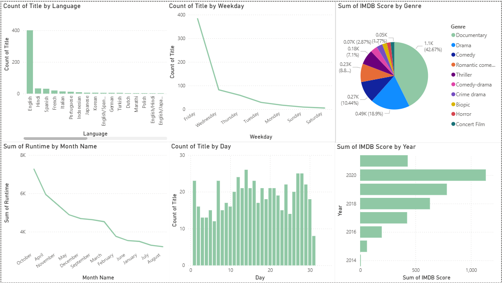

# Disney vs Netflix Dashboard 🎬

## 📊 Overview
This project presents an interactive Power BI dashboard comparing Disney and Netflix content, including trends, distribution, and key insights.

## 🛠️ Tools
- Power BI

## 📈 Key Insights
- Compared content distribution between Disney and Netflix
- Analyzed genre trends across both platforms
- Identified patterns in content availability
- Explored differences in media types

## 📊 Dashboard Preview

## 📂 Files
- `disney-vs-netflix-dashboard.pbix` → Power BI file
- `images/` → Dashboard screenshots

## 🚀 How to Use
- Download the `.pbix` file
- Open it using Power BI Desktop
- Explore the interactive dashboard
